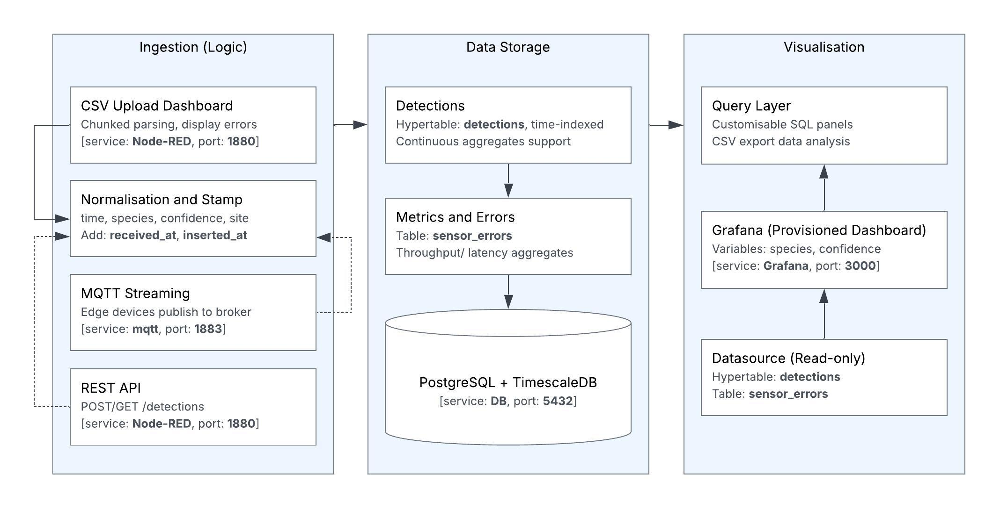

# ChirpCheck: BirdNET CSV Explorer for Acoustic Biodiversity Monitoring


A containerised tool for exploring BirdNET detection CSVs used in passive acoustic monitoring. It converts CSV outputs into a time-series dataset and provides preconfigured dashboards for rapid inspection of detections and ingestion health.

The stack runs with Docker Compose and includes:

- Node-RED for CSV upload and ingestion
- PostgreSQL with TimescaleDB for time-series storage
- Grafana dashboards for interactive exploration



The packaged desktop version of ChirpCheck built on this stack is available here: https://bit.ly/48eLaPT
This repository remains the canonical stack (Node-RED flows, TimescaleDB schema, Grafana dashboards, and CI setup). 


## Quickstart

**Requirements**: Docker & Docker Compose on Linux/macOS/Windows.


1. Clone the repo
```bash
git clone https://github.com/alvaropenaleon/visualisation-for-advanced-biodiversity-monitoring-using-ai-driven-acoustic-technology.git
````

```bash
cd visualisation-for-advanced-biodiversity-monitoring-using-ai-driven-acoustic-technology
```

2. (Optional) Copy .env template and tweak ports/creds
```bash
cp .env.example .env
```

3. Launch services (includes automatic DB migrations)
```bash
docker compose up -d
```

4. Check containers
```bash
docker compose ps
```

**Default ports** (override in `.env`):
- Node‑RED: `http://localhost:1880`
- Grafana: `http://localhost:3000`
- PostgreSQL: `localhost:5432`
- MQTT (Mosquitto, optional): `localhost:1883`

> Grafana default creds are typically `admin` / `admin` but overridden in `.env`. Change on first login.


## Verify the stack

When the stack starts, a `db-bootstrap` container applies SQL migrations from `db/migrations`.

1. Check that Postgres is reachable
```bash
docker compose exec postgres pg_isready -U postgres -d postgres
```

2. Confirm that migrations ran and tables exist
```bash
docker compose exec postgres \
  psql -U postgres -d postgres -c '\dt'
```

Expected output:

```text
               List of relations
 Schema |       Name        | Type  |  Owner
--------+-------------------+-------+----------
 public | ingestion_metrics | table | postgres
 public | sensor_data       | table | postgres
 public | sensor_errors     | table | postgres
 public | sensors           | table | postgres
(4 rows)
```

## Example data upload

The repository includes small CSVs under examples/ to verify the full path.

1. Open **Node‑RED dashboard** at `http://localhost:1880/ui`, upload one of the example files.
2. Open **Grafana** at `http://localhost:3000` and confirm that charts and tables populate in Grafana (time series, species breakdown, etc.)

Note: Any BirdNET-style CSV will work as long as it provides:
- a timestamp (directly or derivable from the file path),
- a species label (scientific and/or common name),
- a confidence score,

Typical headers supported by the normalisation flow include:
- `File`, `Start (s)`, `End (s)`, `Scientific name`, `Common name`, `Confidence`
- or JSON fields like `time`, `sensor_id`, `scientific_name`, `common_name`, `confidence`.


## Configuration

Configuration is declarative and stored in the repository:

- **Node-RED** flows and dashboard stored under `nodered-data/` (mounted to /data and auto-loaded at startup).
- **Grafana** data and dashboards under `grafana-data/` (mounted to `/var/lib/grafana`, includes pre-provisioned dashboards).
- **SQL migrations** under `db/migrations/`, applied automatically at startup by the one-shot `db-bootstrap` service.

## Data model

The database schema is defined in `db/migrations/`. The main tables are:

- `sensor_data` BirdNET detections stored as a TimescaleDB hypertable
- `sensors` sensor metadata
- `ingestion_metrics` ingestion timestamps
- `sensor_errors` rejected rows and parsing errors


## Optional ingestion paths

### HTTP

The stack exposes:

- `POST /detections` on Node-RED (`http://localhost:1880/detections`)

Example:

```bash
curl -X POST http://localhost:1880/detections \
  -H "Content-Type: application/json" \
  -d '[
    {
      "time": "2025-01-01T12:00:00Z",
      "sensor_id": 1,
      "start_seconds": 5,
      "end_seconds": 8,
      "scientific_name": "Geocrinia laevis",
      "common_name": "Southern Smooth Froglet",
      "confidence": 0.92
    }
  ]'
```

### MQTT (streaming)

MQTT ingestion listens on the `detector/data` topic:

```bash
mosquitto_pub -h localhost -p 1883 \
  -t detector/data \
  -m '{
    "time": "2025-01-01T12:00:00Z",
    "sensor_id": 1,
    "start_seconds": 5,
    "end_seconds": 8,
    "scientific_name": "Geocrinia laevis",
    "common_name": "Southern Smooth Froglet",
    "confidence": 0.92
  }'
```

`POST /config` endpoint available Node-RED publishes config messages to `detector/config/<sensor_id>` over MQTT, for edge device configuration pilots.


## Troubleshooting

- **Nothing shows in Grafana**: 
1. Check Node-RED debug tab for CSV parsing/insert errors.
2. Confirm sensor_data has rows:

```bash
docker compose exec postgres \
psql -U postgres -d postgres -c "SELECT COUNT(*) FROM sensor_data;"
```

3. Confirm failed rows are logged into sensor_errors.

```bash
docker compose exec postgres \
psql -U postgres -d postgres -c "SELECT * FROM sensor_errors LIMIT 20;"
```

- **Services not starting / timing out**

Check migration logs:

```bash
docker compose logs db-bootstrap
```
Check individual services:

```bash
docker compose logs -f postgres
docker compose logs -f nodered
docker compose logs -f grafana
```


## Security

Default settings are for local development only (simple passwords, no TLS/auth on HTTP, MQTT may be unauthenticated). For network-exposed deployments enable TLS, and restrict ports.


## Tests

Verify the stack starts correctly, migrations run, and database tables are created. Run locally:

```bash
docker compose -f compose.yml -f compose.ci.yml up -d --build && \
bash ci/wait-for-services.sh && \
bash ci/assert-postgres.sh
```


## Acknowledgements

This project was initially informed by the [Digitalisation AIO Package](https://github.com/ctch3ng/Digitalisation-AIO-Package).
The present architecture including BirdNET focused schema, SQL migrations, Node-RED flows, ingestion metrics, Grafana dashboards, and CI smoke tests  has been engineered specifically for this project.

## Cite this project

> Peña Leon, A., Phan, P., Wiley, T., Peake, I. D., Cheng, C.-T., & Malerba, M. E. *ChirpCheck: A GUI tool to visualise and explore BirdNET output files for passive acoustic monitoring*. Journal of Open Source Software (in review).


## License

This project is licensed under the MIT License – see the [LICENSE](./LICENSE) file for details.


## Dashboard

The stack ships with a pre-built Grafana dashboard and a CSV upload panel in Node-RED so users can go from raw BirdNET CSVs to exploratory plots in   minutes.

