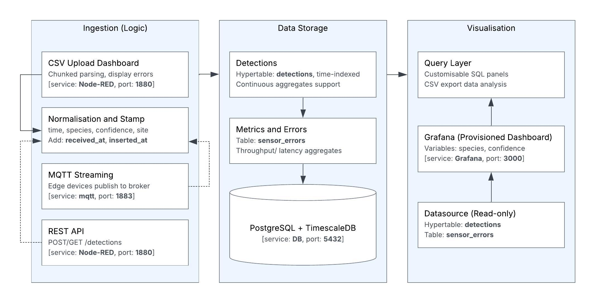
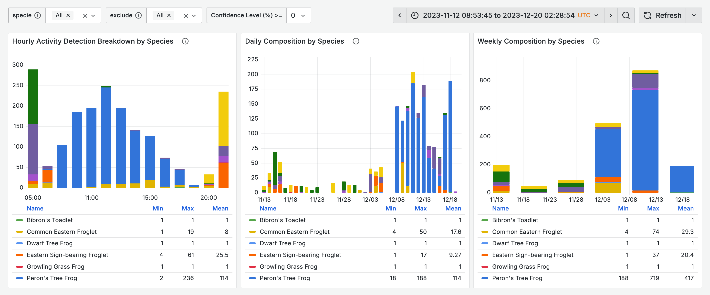

# Summary

Passive acoustic monitoring (PAM) uses autonomous recorders to capture environmental soundscapes, enabling continuous, non-invasive detection of vocal species at large scales. Coupled with AI classifiers such as BirdNET [@kahl2021birdnet] and increasingly affordable recorders [@hill2018audiomoth], PAM can produce vast volumes of timestamped species detections. However, converting these BirdNET-style CSV outputs into summaries or exploratory plots typically requires coding expertise, creating a barrier for non-programmers and slowing practitioners, land managers, and field ecologists who need quick, code-free ways to review detections.

ChirpCheck is an open-source tool that turns BirdNET-style CSV files into reproducible visualisations in an interactive dashboard. It runs as a single Docker Compose stack that launches a Node-RED file-upload page [@nodered], a PostgreSQL database with a TimescaleDB hypertable for structured time-series storage [@postgresql] [@timescaledbHypertables], and pre-built Grafana dashboards for exploration [@grafana]. In addition to CSV upload, ChirpCheck can receive detections directly from field devices (e.g., Raspberry Pi recorders) via an optional MQTT input or a lightweight REST API [@oasis2019mqtt].

Users can explore summary statistics, time-series patterns, daily and hourly heatmaps, and comparisons of different periods. When streaming is enabled, ChirpCheck records when each detection was received, allowing the dashboards to highlight delays, gaps, or throughput issues so technical artefacts are not mistaken for ecological patterns. This creates a fast, code-free workflow that converts raw files or live device streams into defensible exploratory analyses and reproducible figures for ecologists, students, and land managers.

# Statement of need

Most users work with CSV files produced by BirdNET, whose classifier outputs a standardised format that has become the default starting point for many detection analyses [@kahl2021birdnet]. Tools such as BirdNET-Analyzer provide useful post-processing, but they require coding skills and do not offer a quick way to verify whether data were ingested correctly, which can lead to misleading ecological interpretations if files are missing, delayed, or incomplete [@birdnetAnalyzer]. As a result, many BirdNET workflows depend on R or Python scripts or on tool-specific visualisers that offer limited support for reproducibility or for checking the health of the data pipeline. This makes it difficult for non-programmers to quickly understand device performance, shifts in calling activity, or field summaries, especially when working with dozens of CSV files.

Commercial platforms such as Wildlife Acoustics Kaleidoscope [@kaleidoscope] and ARBIMON [@arbimon] offer polished interfaces but are proprietary and cloud-based. This limits their suitability where data must remain local, where internet access is unreliable, or where open and reproducible workflows are required. They also do not natively align with BirdNET’s CSV outputs, despite BirdNET being one of the most widely used AI classifiers for biodiversity monitoring. Open-source ecoacoustic tools, including the OpenSoundscape library [@opensoundscape] and the Open Ecoacoustics / Acoustic Workbench platform [@qutEcoacousticsWorkbench], provide powerful analysis capabilities and broad data portals; however, they do not focus on a simple, CSV-first, machine-local workflow with built-in checks on data quality during ingestion.

Local, GUI-based tools are particularly important in teaching environments, field stations, or projects with strict data-governance constraints. ChirpCheck addresses this need by offering a CSV-first, fully local, and reproducible workflow that bundles ingestion, automated normalisation, diagnostics, and curated dashboards into a single versioned package. It provides an accessible first step to quickly inspect data, visualise broad patterns, and confirm that the dataset is behaving as expected. ChirpCheck lowers the barrier to explore detections while giving access to operational and analytical indicators that help interpret ecological patterns in context. Rather than replacing specialised modelling tools, it complements them by ensuring that upstream data are organised, quality-checked, and easy to explore before further analysis.

# Architecture

ChirpCheck comprises a three-tier architecture for post-classification time-series analysis.

**Ingestion (Node-RED)**: CSV files are parsed and standardised so that timestamps, species names, confidence scores, and site labels follow a consistent format. Records are inserted in batches to improve throughput, and each record is tagged with the time it was received and stored, allowing users to detect delays or data-flow issues. 

**Storage (PostgreSQL / TimescaleDB)**: All detections are saved in a time-partitioned hypertable optimised for fast time-series queries. Additional tables record system metrics and any ingestion errors. Indexes on commonly used fields ensure responsive filtering, and continuous aggregates support efficient generation of summaries and larger roll-ups [@freedmanBlackwoodTimescaleArch].

**Visualisation (Grafana)**: Dashboards are automatically provisioned and include filters (e.g., species, confidence thresholds) to make exploration straightforward. Users can view time-series plots, heatmaps, summaries, and comparison panels, and can export the underlying queries as CSV files for use in other analysis tools.

# Key features

ChirpCheck’s functionality is built around the practical needs of ecological monitoring:

- **CSV ingestion with clear feedback**. Users can upload CSV files through a simple interface. The system parses data in chunks for efficiency and provides live progress updates and feedback on any issues encountered.
- **Consistent, standardised data**. All records are normalised (timestamps, species names, and confidence scores) so that queries, filters, and exports behave predictably across datasets.
- **Built-in observability and error tracking**. Each row is tagged with the time it was received and stored, enabling latency and throughput metrics to be monitored in the dashboard. A dedicated `sensor_errors` table retains raw problematic entries and diagnostic details, supporting detection of gaps or ingestion issues.
- **Accessible dashboards for fast exploration**. The interface includes preconfigured heatmaps, time-series plots, data-quality panels, and summary views. Users can apply species and confidence filters, compare different time periods, view tooltips, and export any panel’s underlying query as a CSV file.
- **Reproducible, extensible deployment and APIs**. The system runs through a Docker Compose setup with versioned flows and JSON-provisioned dashboards. Optional MQTT streaming and simple POST/GET endpoints (`/detections`) support real-time data from field devices and programmatic ingestion or retrieval.

# Availability

ChirpCheck is open source under the MIT licence in a public [GitHub repository](https://github.com/alvaropenaleon/visualisation-for-advanced-biodiversity-monitoring-using-ai-driven-acoustic-technology) and is available in two forms:

- **Packaged (CSV-first, recommended)**. Download the bundle, run with Docker Compose, open the upload UI, and upload BirdNET-style CSVs. Runs fully offline without needed code changes on Windows, macOS, and Linux.
- **Source (for extensibility)**. This option provides the full Docker Compose stack, including Node-RED flows, the TimescaleDB schema, and JSON-provisioned Grafana dashboards. It supports programmatic ingestion via REST or MQTT and is suited for users who want to enable streaming, add custom panels, or adjust the database schema.

# Acknowledgements

We thank the Centre for Nature Positive Solutions and the School of Computing Technologies at RMIT, and the broader project team involved in the underlying biodiversity monitoring programmes for feedback on ecological requirements and workflow design, and acknowledge the Node-RED, TimescaleDB, and Grafana communities whose open tooling made a transparent, reproducible stack feasible. Dr Malerba thanks the support of the Australian Government through the Australian Research Council (project ID: DE220100752).

# References
